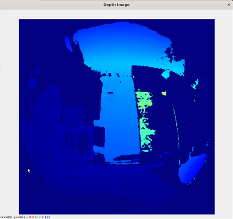

## Azure Kinect DK on Jetson Xavier


When you use Jetpack 5.x on Xavier NX, it uses Ubuntu 20.04. And Microsoft recommends to use 18.04 when using Azure Kinetic.

So I tried with Jetpack 4.6, which uses Ubuntu 18.04, but the error related with OpenGL version occured with using `Depth Engine`.


Furthermore, Microsoft usually gives SDK only for AMD64 architecture, results that Body Tracking SDK is not supported in ARM even in 2023.


So if you're trying to use Azure Kinect on Jetson Xavier NX, I recommend to use Jetpack 5.x, and install packages using `dpkg` instead of adding Microsoft repository to use `apt`.

These steps below were presented in Jetpack 5.1.


## 1. Get debian package files

You can get sdk packages files for ARM architecture from https://packages.microsoft.com/ubuntu/18.04/multiarch/prod/

It's for 18.04, but still worked properly in 20.04 for me at least.


```
wget https://packages.microsoft.com/ubuntu/18.04/multiarch/prod/pool/main/k/k4a-tools/k4a-tools_1.4.1_arm64.deb
wget https://packages.microsoft.com/ubuntu/18.04/multiarch/prod/pool/main/libk/libk4a1.4/libk4a1.4_1.4.1_arm64.deb
wget https://packages.microsoft.com/ubuntu/18.04/multiarch/prod/pool/main/libk/libk4a1.4-dev/libk4a1.4-dev_1.4.1_arm64.deb
```


## 2. Install Kinect Packages using `dpkg` 

By using `dpkg` package, you can install packages directly from `.deb` files.  

```
sudo apt install dpkg

sudo dpkg -i libk4a1.4_1.4.1_arm64.deb
sudo dpkg -i libk4a1.4-dev_1.4.1_arm64.deb
sudo dpkg -i k4a-tools_1.4.1_arm64.deb
```

Notice that installation steps must be order of `libk4a` > `libk4a-dev` > `k4a-tools`.

## 3. `udev` Rule Setiing

[Follow this](https://github.com/microsoft/Azure-Kinect-Sensor-SDK/blob/develop/docs/usage.md#linux-device-setup) to add `udev` rule to use device

* Copy 'scripts/99-k4a.rules' from [Azure-Kinetct-Sensor-SDK](https://github.com/microsoft/Azure-Kinect-Sensor-SDK) into '/etc/udev/rules.d/'

* Detach and reattach Azure Kinect devices if attached during this process.

## 4. Run Azure Kinect SDK

You can start just same SDK with Windows' one by below. 

```
k4aviewer
```

## 5. Azure Kinetic in Python

By using [pyKineticAzure](https://github.com/ibaiGorordo/pyKinectAzure), you can easily use Kinetic's functions in Python.

There's many examples below `/pyKineticAzure/examples`, but since there's no Body Tracking SDK for ARM yet, wasn't able to test those functions.

```
cd pyKinetctAzure/examples
python3 exampleDepthImage.py
```


Check more information about library in [here](https://github.com/ibaiGorordo/pyKinectAzure).